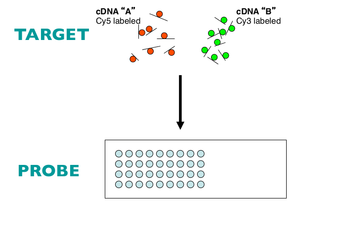
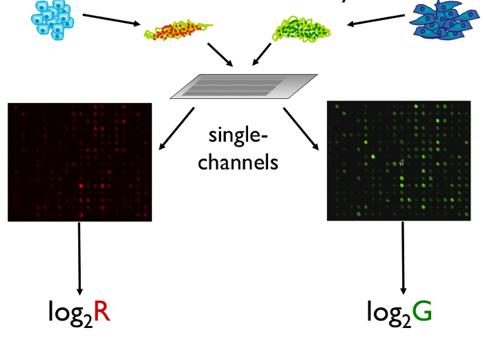
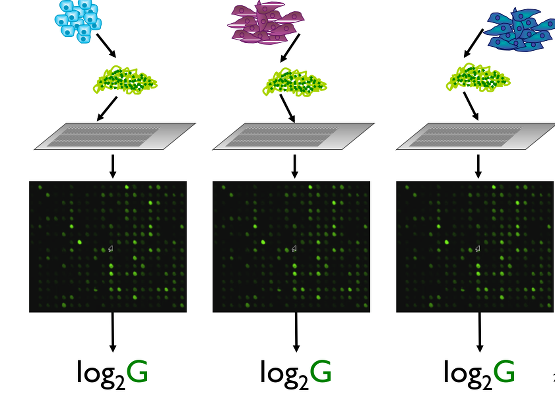
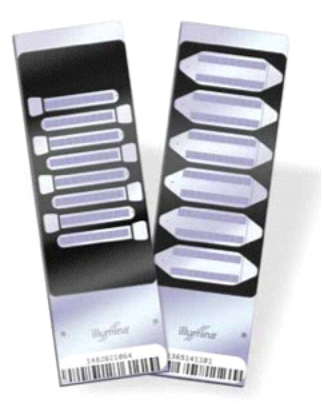
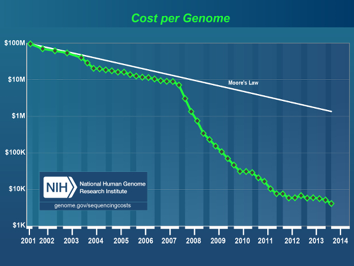
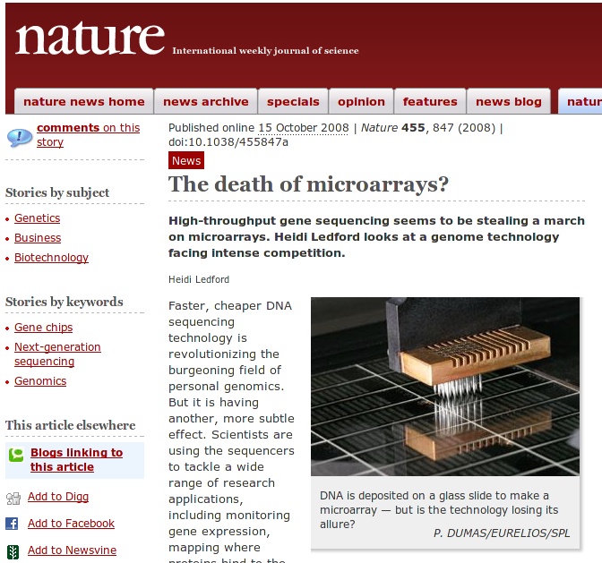
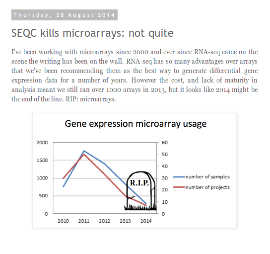
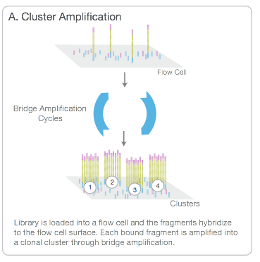
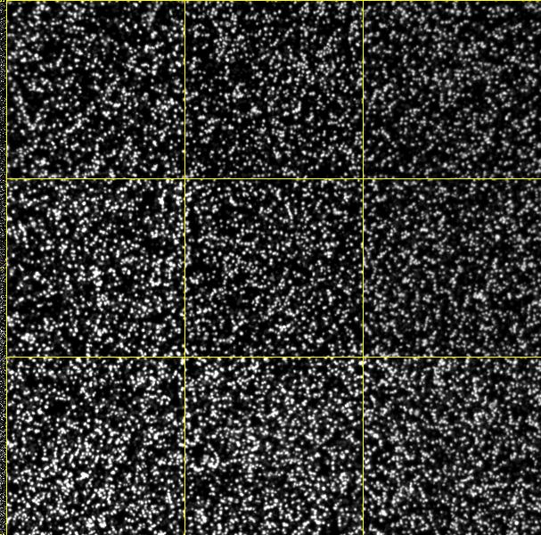

#Historical overview

## Probe and target



## Two-colour arrays



## Single-Channel



## Look at a 'modern' microarray



Around 48,000 genes per sample, 12 samples on a slide

##Microarrays vs sequencing

- Probe design issues
- Limited number of novel findings
- Genome coverage
- Relative costs
- Access to equipment 

## The cost of sequencing



##Reports of the death of microarrays



##Reports of the death of microarrays. Greatly exagerated?
http://core-genomics.blogspot.co.uk/2014/08/seqc-kills-microarrays-not-quite.html



# What are NGS data?


## Different terminologies

- *N*ext *G*eneration *S*equencing
- *H*igh-*T*hroughput *S*equencing
- 2nd Generation Sequencing
- Massively Parallel Sequencing


## Different Flavours

- RNA-seq
- ChIP-seq
- Exome-seq
- etc....
- Paired-end / single-end


## Illumina sequencing *

- Link to video from their site

<iframe width="560" height="315" src="http://www.youtube.com/embed/HMyCqWhwB8E?iframe&rel=0" frameborder="0" allowfullscreen></iframe>

http://www.illumina.com/content/dam/illumina-marketing/documents/products/illumina_sequencing_introduction.pdf

\* Other sequencing technologies are available

## Illumina sequencing


http://www.illumina.com/content/dam/illumina-marketing/documents/products/illumina_sequencing_introduction.pdf

## Illumina sequencing



http://www.illumina.com/content/dam/illumina-marketing/documents/products/illumina_sequencing_introduction.pdf

## Illumina sequencing


http://www.illumina.com/content/dam/illumina-marketing/documents/products/illumina_sequencing_introduction.pdf


## Image processing 

- Sequencing produces *gazillions* of high-resolution TIFF images; not unlike microarray data
- One per-cluster, per-cycle, per-base



## Image processing

- Firecrest


- *"Uses the raw TIF files to locate clusters on the image, and outputs the cluster intensity, X,Y positions, and an estimate of the noise for each cluster. The output from image analysis provides the input for base calling."*

    + http://openwetware.org/wiki/BioMicroCenter:IlluminaDataPipeline
- **You will never have to do this**
    + In fact, the TIFF images are deleted by the instrument
    
## Base-calling

- Bustard


- *"Uses cluster intensities and noise estimate to output the sequence of bases read from each cluster, along with a confidence level for each base."*
    + http://openwetware.org/wiki/BioMicroCenter:IlluminaDataPipeline
- **You will never have to do this**

## Alignment

- Locating where each generated sequence came from in the genome
- Outside the scope of this course
- *Usually* perfomed automatically by a sequencing service
- For most of what follows in the course, we will assume alignment has been performed and we are dealing with aligned data

# Data formats

## Raw reads - fastq

- The most basic file type you will see is *fastq*
- This represents the *un-aligned* sequences
- Each sequence is described over 4 lines
- No standard file extension. *.fq*, *.fastq*, *.sequence.txt*
- Essentially they are text files
- They can be compressed and appear as *.fq.gz*

```
@SEQ_ID
GATTTGGGGTTCAAAGCAGTATCGATCAAATAGTAAATCCATTTGTTCAACTCACAGTTT
+
!''*((((***+))%%%++)(%%%%).1***-+*''))**55CCF>>>>>>CCCCCCC65
```
~ 250 Million reads (sequences) per Hi-Seq lane
- Same format regardless of sequencing protocol (i.e. RNA-seq, ChIP-seq, DNA-seq etc)

## Fastq sequence names

```
@HWUSI-EAS100R:6:73:941:1973#0/1
```

- The name of the sequencer (HWUSI-EAS100R)
- The flow cell lane (6)
- Tile number with the lane (73)
- x co-ordinate within the tile (941)
- y co-ordinate within the tile (1973)
- \#0 index number for a multiplexed sample 
-  /1; the member of a pair, /1 or /2 (paired-end or mate-pair reads only)

## Fastq quality scores


## Aligned reads - sam

- **S**equence **A**lignment **M**atrix (sam)
- Human readable format

```
head mysequences.sam
```

- Large size on disk; ~100s of Gb

## Aligned reads - bam

- A *binary* version of sam
- Attempting to read will print garbage to the screen

```
samtools view mysequences.bam | head
```

## Aligned reads

- bam files can be indexed

# Other processing steps

## Sorting a bam file

## Marking Duplicates

## Quality metrics

- Depth of sequencing
- Coverage

## A very useful tool

- FastQC, from Babraham Bioinformatics Core


# Why use R and Bioconductor?

## Legacy from the good old days
- Many of the lessons learnt still applicable
- Respected software / methods
- Respected developers
- Established community
- Reproducibility

## Useful data types in R
- data frame 
- classes for storing metadata

## Analysis methods


# Other tools worth knowing about

## Non-R tools (that we use every day)
- bwa
- bowtie
- samtools
- picard
- fastqc
- GATK
- IGV