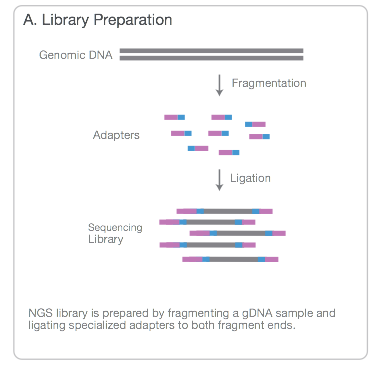

# Why do sequencing?

##Microarrays vs sequencing

- Probe design issues with microarrays
    + *'Dorian Gray effect'* http://www.biomedcentral.com/1471-2105/5/111
    + ' ...mappings are frozen, as a Dorian Gray-like syndrome: the apparent eternal youth of the mapping does not reflect that somewhere the 'picture of it' decays'
- Sequencing data are 'future proof'
    + if a new genome version comes along, just re-align the data!
    + can grab published-data from public repositories and re-align to **your** own choice of genome / transcripts and aligner
- Limited number of novel findings from microarays
    + can't find what you're not looking for!
- Genome coverage
    + some areas of genome are problematic to design probes for
- Maturity of analysis techniques
    + on the other hand, analysis methods and workflows for microarrays are well-established
    + until recently...
    
## The cost of sequencing


##Reports of the death of microarrays


##Reports of the death of microarrays. Greatly exagerated?

http://core-genomics.blogspot.co.uk/2014/08/seqc-kills-microarrays-not-quite.html


# What are NGS data?


## Different terminologies for same thing

- *N*ext *G*eneration *S*equencing
- *H*igh-*T*hroughput *S*equencing
- 2nd Generation Sequencing
- Massively Parallel Sequencing
- Also different library preparation
    + RNA-seq *
    + ChIP-seq *
    + Exome-seq
    + DNA-seq
    + Methyl-seq
    + .....


## Illumina sequencing *

- Employs a *'sequencing-by-synthesis'* approach

<iframe width="420" height="315" src="https://www.youtube.com/embed/HMyCqWhwB8E" frameborder="0" allowfullscreen></iframe>

http://www.illumina.com/content/dam/illumina-marketing/documents/products/illumina_sequencing_introduction.pdf

\* Other sequencing technologies are available

## Illumina sequencing



http://www.illumina.com/content/dam/illumina-marketing/documents/products/illumina_sequencing_introduction.pdf

## Illumina sequencing


http://www.illumina.com/content/dam/illumina-marketing/documents/products/illumina_sequencing_introduction.pdf

## Illumina sequencing


http://www.illumina.com/content/dam/illumina-marketing/documents/products/illumina_sequencing_introduction.pdf

## Paired-end


## Multiplexing


## Image processing 

- Sequencing produces high-resolution TIFF images; not unlike microarray data
- 100 tiles per lane, 8 lanes per flow cell, 100 cycles
- 4 images (A,G,C,T) per tile per cycle = 320,000 images
- Each *TIFF* image ~ 7Mb = 2,240,000 Mb of data (**2.24TB**)


## Image processing

- Firecrest


- *"Uses the raw TIF files to locate clusters on the image, and outputs the cluster intensity, X,Y positions, and an estimate of the noise for each cluster. The output from image analysis provides the input for base calling."*

    + http://openwetware.org/wiki/BioMicroCenter:IlluminaDataPipeline
- **You will never have to do this**
    + In fact, the TIFF images are deleted by the instrument
    
## Base-calling

- Bustard


- *"Uses cluster intensities and noise estimate to output the sequence of bases read from each cluster, along with a confidence level for each base."*
    + http://openwetware.org/wiki/BioMicroCenter:IlluminaDataPipeline
- **You will never have to do this**

## Alignment

- Locating where each generated sequence came from in the genome
- Outside the scope of this course
- *Usually* perfomed automatically by a sequencing service
- For most of what follows in the course, we will assume alignment has been performed and we are dealing with aligned data
    + Popular aligners
    + bwa http://bio-bwa.sourceforge.net/
    + bowtie http://bowtie-bio.sourceforge.net/index.shtml
    + novoalign http://www.novocraft.com/products/novoalign/
    + stampy http://www.well.ox.ac.uk/project-stampy
    + many, many more.....
- ***Demo to follow after this talk***

## Post-processing of aligned files

- Marking of PCR duplicates
    + PCR amplification errors can cause some sequences to be over-represented
    + Chances of any two sequences aligning to the same position are *unlikely*
    + Caveat: obviously this depends on amount of the genome you are capturing
    + Such reads are *marked* but not usually removed from the data
    + Most downstream methods will ignore such reads
    + Typically, [***picard***](http://broadinstitute.github.io/picard/) is used 
- Sorting
    + Reads can be sorted according to genomic position
        + [***samtools***](http://www.htslib.org/)
- Indexing
    + Allow efficient access
        + [***samtools***](http://www.htslib.org/)


# Data formats

## Raw reads - fastq

- The most basic file type you will see is *fastq*
    + Data in public-repositories (e.g. Short Read Archive, GEO) tend to be in this format
- This represents all sequences created after imaging process
- Each sequence is described over 4 lines
- No standard file extension. *.fq*, *.fastq*, *.sequence.txt*
- Essentially they are text files
    + Can be manipulated with standard unix tools; e.g. *cat*, *head*, *grep*, *more*, *less*
- They can be compressed and appear as *.fq.gz*
- Same format regardless of sequencing protocol (i.e. RNA-seq, ChIP-seq, DNA-seq etc)

```
@SEQ_ID
GATTTGGGGTTCAAAGCAGTATCGATCAAATAGTAAATCCATTTGTTCAACTCACAGTTT
+
!''*((((***+))%%%++)(%%%%).1***-+*''))**55CCF>>>>>>CCCCCCC65
```
~ 250 Million reads (sequences) per Hi-Seq lane

## Fastq sequence names

```
@HWUSI-EAS100R:6:73:941:1973#0/1
```

- The name of the sequencer (HWUSI-EAS100R)
- The flow cell lane (6)
- Tile number with the lane (73)
- x co-ordinate within the tile (941)
- y co-ordinate within the tile (1973)
- \#0 index number for a multiplexed sample 
-  /1; the member of a pair, /1 or /2 (paired-end or mate-pair reads only)

## Fastq quality scores

```
!''*((((***+))%%%++)(%%%%).1***-+*''))**55CCF>>>>>>CCCCCCC65
```

- Quality scores $$ Q = -10log_{10}p$$
    + Q = 30, p=0.001
    + Q = 20, p=0.01
    + Q = 10, p=0.1
- These numeric quanties are *encoded* as **ASCII** code
    + Sometimes an offset is used before encoding

## Fastq quality scores


## Useful for quality control

- FastQC, from Babraham Bioinformatics Core; http://www.bioinformatics.babraham.ac.uk/projects/fastqc/
    + ***we will look at this in detail later***


- Based on these plots we may want to *trim* our data
    + A popular choice is ***trimmomatic*** http://www.usadellab.org/cms/index.php?page=trimmomatic
    + or ***Trim Galore!*** from the makers of FastQC

## Aligned reads - sam

- **S**equence **A**lignment **M**atrix (sam) http://samtools.github.io/hts-specs/SAMv1.pdf
- *Header* lines followed by tab-delimited lines
    + Header gives information about the alignment and references sequences used
```
@HD     VN:1.0  SO:coordinate
@SQ     SN:chr1 LN:249250621
@SQ     SN:chr10        LN:135534747
@SQ     SN:chr11        LN:135006516
```


```
HWI-ST1001:137:C12FPACXX:7:1115:14131:66670     0       chr1    12805   1       42M4I5M *
0       0       TTGGATGCCCCTCCACACCCTCTTGATCTTCCCTGTGATGTCACCAATATG     
CCCFFFFFHHGHHJJJJJHJJJJJJJJJJJJJJJJIJJJJJJJJJJJJIJJ     
AS:i:-28        XN:i:0  XM:i:2  XO:i:1XG:i:4   NM:i:6  MD:Z:2C41C2     YT:Z:UU NH:i:3  
CC:Z:chr15      CP:i:102518319  XS:A:+  HI:i:0

```

- http://homer.salk.edu/homer/basicTutorial/samfiles.html


- Large size on disk; ~100s of Gb
    + Can be manipulated with standard unix tools; e.g. *cat*, *head*, *grep*, *more*, *less*

## Sam format - key columns

```
HWI-ST1001:137:C12FPACXX:7:1115:14131:66670     0       chr1    12805   1       42M4I5M *
0       0       TTGGATGCCCCTCCACACCCTCTTGATCTTCCCTGTGATGTCACCAATATG     
CCCFFFFFHHGHHJJJJJHJJJJJJJJJJJJJJJJIJJJJJJJJJJJJIJJ     
AS:i:-28        XN:i:0  XM:i:2  XO:i:1XG:i:4   NM:i:6  MD:Z:2C41C2     YT:Z:UU NH:i:3  
CC:Z:chr15      CP:i:102518319  XS:A:+  HI:i:0

```


- http://samtools.github.io/hts-specs/SAMv1.pdf
    + Read name
    + Chromosome
    + Position
    + Mapping quality
    + etc...

## Sam file flags

- Represent useful QC information
    + Read is unmapped
    + Read is paired / unpaired
    + Read failed QC
    + Read is a PCR duplicate 
- https://broadinstitute.github.io/picard/explain-flags.html


## Aligned reads - bam

- *Exactly* the same information as a sam file
- ..except that it is *binary* version of sam
- compressed around x4
- Attempting to read will print garbage to the screen
- bam files can be indexed
    + Produces an index file with the same name as the bam file, but with **.bai** extension

```
samtools view mysequences.bam | head
```

- N.B The sequences can be extracted by various tools to give *fastq*

## samtools flagstat

- Useful *command-line* tool as part of **samtools**

```
$ samtools flagstat NA19914.chr22.bam
2109857 + 0 in total (QC-passed reads + QC-failed reads)
0 + 0 secondary
0 + 0 supplimentary
40096 + 0 duplicates
2064356 + 0 mapped (97.84%:-nan%)
2011540 + 0 paired in sequencing
1005911 + 0 read1
1005629 + 0 read2
1903650 + 0 properly paired (94.64%:-nan%)
1920538 + 0 with itself and mate mapped
45501 + 0 singletons (2.26%:-nan%)
5134 + 0 with mate mapped to a different chr
4794 + 0 with mate mapped to a different chr (mapQ>=5)

```


## Aligned files in IGV

- Once our bam files have been *indexed* we can view them in IGV
- This is **highly recommended**


## Other misc. format

Often said that Bioinformaticians love coming up with new file formats

- Useful link : http://www.genome.ucsc.edu/FAQ/FAQformat.html
- bed ; only first three columns are required
```    
track name=pairedReads description="Clone Paired Reads" useScore=1
chr22 1000 5000 cloneA 960 + 1000 5000 0 2 567,488, 0,3512
chr22 2000 6000 cloneB 900 - 2000 6000 0 2 433,399, 0,3601 
```
- gff; (gene feature format)
```
track name=regulatory description="TeleGene(tm) Regulatory Regions"
visibility=2`
chr22  TeleGene enhancer  10000000  10001000  500 +  .  touch1
chr22  TeleGene promoter  10010000  10010100  900 +  .  touch1
chr22  TeleGene promoter  10020000  10025000  800 -  .  touch2
```
- wig;
```
variableStep chrom=chr2
300701 12.5
300702 12.5
300703 12.5
300704 12.5
300705 12.5
```    

## What happens next?

- Hands-on examples of NGS data
    + Alignment (Shamith)
    + Quality assessment of NGS data (Ines)